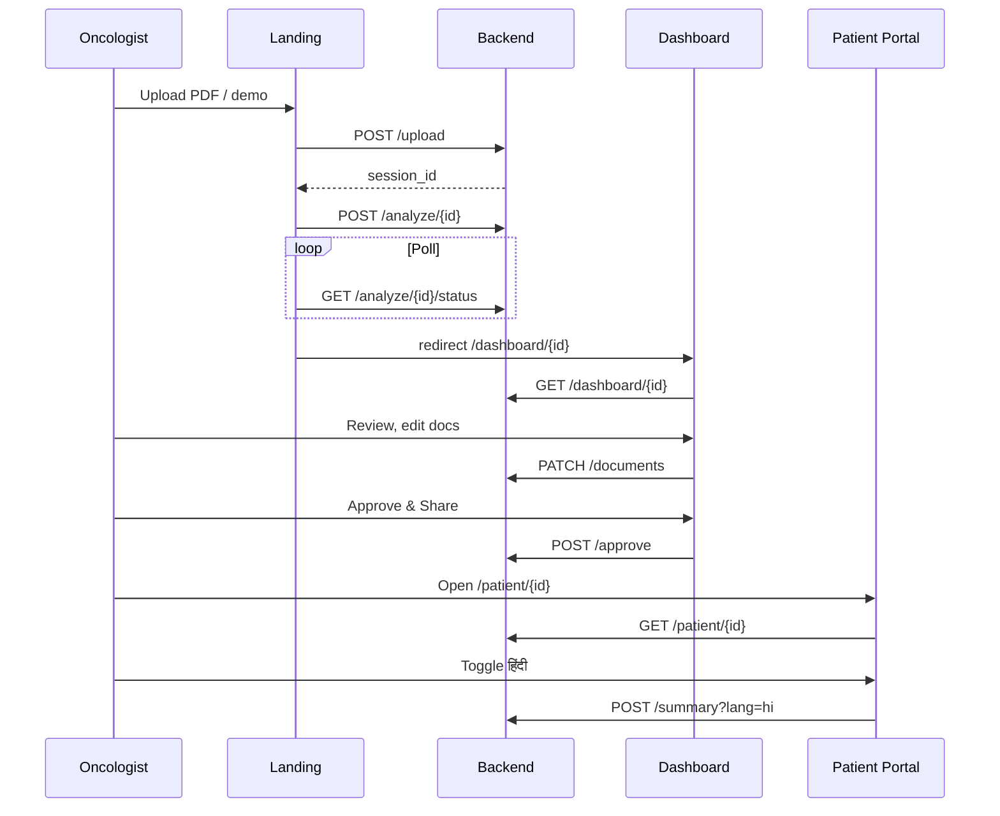

# Oncopilot AI — Frontend Implementation Guide

Implementation spec for the Next.js frontend. Aligned with [s.md](./s.md) (two-view architecture, `SessionPayload` contract, RAG pipeline).

**Stack:** Next.js 14+ (App Router) · TypeScript · Tailwind CSS · React Query (TanStack Query)

---

## 1. Quick Reference

| Route | View | Audience | API |
|-------|------|----------|-----|
| `/` | Upload landing | Oncologist | `POST /api/upload`, `POST /api/analyze` |
| `/dashboard/[sessionId]` | View 1 — Enterprise Dashboard | Oncologist / CRC | `GET /api/dashboard/{id}`, `POST .../approve`, `PATCH .../documents` |
| `/patient/[sessionId]` | View 2 — Localization Portal | Patient + family | `GET /api/patient/{id}`, `POST .../summary` |
| `/audit/[sessionId]` | Audit trail | Enterprise / demo | `GET /api/audit/{id}` |

**Base URL:** `process.env.NEXT_PUBLIC_API_URL` (default `http://localhost:8000`)

---

## 2. Repository Structure

```
frontend/
├── app/
│   ├── layout.tsx                          # Root layout, fonts, providers
│   ├── page.tsx                            # Upload landing
│   ├── dashboard/[sessionId]/
│   │   ├── page.tsx                        # View 1 main page
│   │   └── loading.tsx                     # Skeleton while fetching
│   ├── patient/[sessionId]/
│   │   ├── page.tsx                        # View 2 main page
│   │   └── loading.tsx
│   └── audit/[sessionId]/
│       └── page.tsx                        # Audit trail
├── components/
│   ├── shared/
│   │   ├── PipelineProgress.tsx            # Upload → analyze stepper
│   │   ├── BiomarkerBadge.tsx              # EGFR, PD-L1, etc.
│   │   ├── SourceSnippetPopover.tsx        # "View Source" OCR link
│   │   ├── DraftBanner.tsx                 # "DRAFT — for oncologist review"
│   │   └── ErrorState.tsx
│   ├── view1/                              # Oncologist Enterprise Dashboard
│   │   ├── DashboardHeader.tsx
│   │   ├── RiskFlagBanner.tsx
│   │   ├── MolecularProfileGrid.tsx
│   │   ├── CaseComparisonTable.tsx         # Similar cohort cards + filters
│   │   ├── TrialMatchTable.tsx
│   │   ├── PrognosisBand.tsx
│   │   ├── DocumentEditor.tsx              # Inline edit for all doc types
│   │   ├── MDTBriefPanel.tsx
│   │   ├── DocumentTabs.tsx                # Profile | Similar | Trials | Docs | Prognosis
│   │   └── ApproveShareButton.tsx
│   └── view2/                              # Patient Localization Portal
│       ├── PortalLockedState.tsx           # Shown when status !== "shared"
│       ├── LanguageToggle.tsx              # en | hi | ta | kn
│       ├── PlainLanguageSection.tsx
│       ├── PatientSummaryCard.tsx
│       ├── TrialDiscussCard.tsx
│       ├── QuestionsForDoctor.tsx
│       └── PortalFooter.tsx
├── lib/
│   ├── api.ts                              # Fetch wrappers + React Query hooks
│   ├── types.ts                            # SessionPayload, PatientLocalizedView, etc.
│   └── constants.ts                        # Lang codes, status labels, color thresholds
├── hooks/
│   ├── useDashboard.ts
│   ├── usePatientPortal.ts
│   └── usePipeline.ts                      # Upload + analyze orchestration
└── package.json
```

---

## 3. Environment Variables

```bash
# frontend/.env.local
NEXT_PUBLIC_API_URL=http://localhost:8000
NEXT_PUBLIC_DEMO_PATIENT=true   # optional — show "Load demo case" on landing
```

---

## 4. API Endpoints (Full Contract)

All paths are relative to `NEXT_PUBLIC_API_URL`. Backend prefix is `/api`.

### 4.1 Upload & Pipeline

#### `POST /api/upload`

Upload clinical documents (PDFs + optional image). Creates session, runs OCR only.

**Request:** `multipart/form-data`

| Field | Type | Required | Notes |
|-------|------|----------|-------|
| `files` | `File[]` | Yes | Pathology, radiology, NGS, labs |
| `patient_description` | `string` | No | Self-reported symptoms |
| `demo` | `boolean` | No | If `true`, backend uses `DEMO_PATIENT` fixture |

**Response `201`:**

```json
{
  "session_id": "sess_abc123",
  "status": "uploaded",
  "file_count": 3,
  "ocr_preview": "First 500 chars of extracted text..."
}
```

**Errors:** `400` invalid file type · `413` file too large · `500` OCR failure

---

#### `POST /api/analyze/{sessionId}`

Triggers full pipeline: Agent 1 → retrieval → Agent 2 → document generation → `SessionPayload`.

**Request:** empty body (or optional `{ "regenerate_docs": ["treatment_plan"] }` for partial regen)

**Response `200`:** Full `SessionPayload` (see §5)

**Response `202`:** Pipeline still running

```json
{
  "session_id": "sess_abc123",
  "status": "processing",
  "current_step": "similarity",
  "steps_completed": ["ocr", "extract"]
}
```

Poll every 2–3s until `200` or `GET /api/analyze/{sessionId}/status`.

---

#### `GET /api/analyze/{sessionId}/status`

Lightweight poll endpoint for `PipelineProgress`.

**Response `200`:**

```json
{
  "session_id": "sess_abc123",
  "status": "processing",
  "current_step": "agent2",
  "steps_completed": ["ocr", "extract", "similarity", "trial_match", "knowledge_retrieve"],
  "steps_total": 9,
  "error": null
}
```

`status`: `uploaded` | `processing` | `ready` | `failed`

`current_step` values: `ocr` | `extract` | `similarity` | `trial_match` | `knowledge_retrieve` | `agent2` | `documents` | `ready`

---

### 4.2 View 1 — Oncologist Dashboard

#### `GET /api/dashboard/{sessionId}`

Returns full clinical `SessionPayload`. No synthesis layer — render as-is.

**Response `200`:** `SessionPayload`

**Errors:** `404` session not found · `425` pipeline not complete (show progress)

---

#### `PATCH /api/dashboard/{sessionId}/documents`

Save oncologist inline edits before approval.

**Request:**

```json
{
  "documents": {
    "treatment_plan": "edited markdown/text...",
    "mdt_brief": "...",
    "trial_report": "...",
    "referral_letter": "...",
    "toxicity_check": "...",
    "prognosis": "...",
    "patient_summary_clinical": "..."
  }
}
```

**Response `200`:** Updated `SessionPayload`

---

#### `POST /api/dashboard/{sessionId}/approve`

Explicit approval gate. Sets `status: "shared"`, snapshots `approved_documents`, unlocks View 2.

**Request:**

```json
{
  "approved_documents": {
    "treatment_plan": "...",
    "patient_summary_clinical": "...",
    "trial_report": "...",
    "toxicity_check": "..."
  },
  "approver_note": "Reviewed for clinic — share with family"
}
```

If `approved_documents` omitted, backend snapshots current `documents` field.

**Response `200`:**

```json
{
  "session_id": "sess_abc123",
  "status": "shared",
  "approved_at": "2026-06-05T14:30:00Z",
  "patient_portal_url": "/patient/sess_abc123"
}
```

---

### 4.3 View 2 — Patient Localization Portal

#### `GET /api/patient/{sessionId}`

Returns localized patient view. **403 if not approved.**

**Query params:**

| Param | Default | Values |
|-------|---------|--------|
| `lang` | `en` | `en` \| `hi` \| `ta` \| `kn` |

**Response `200`:** `PatientLocalizedView` (see §5)

**Response `403`:**

```json
{
  "error": "not_shared",
  "message": "Your doctor is reviewing your results",
  "status": "pending"
}
```

Frontend renders `PortalLockedState` — never show partial clinical data.

---

#### `POST /api/patient/{sessionId}/summary`

Regenerate empathetic synthesis in chosen language. Uses **approved_documents only** — never re-runs Agent 1.

**Query params:** `lang=hi` (required)

**Request:** empty body

**Response `200`:** `PatientLocalizedView`

**Errors:** `403` not shared · `404` session not found

---

### 4.4 Audit

#### `GET /api/audit/{sessionId}`

Full audit trail for enterprise / demo stakeholders.

**Response `200`:**

```json
{
  "session_id": "sess_abc123",
  "entries": [
    {
      "step": "extract",
      "model": "llama-3.1-70b-versatile",
      "input_hash": "sha256:...",
      "retrieved_ids": [],
      "timestamp": "2026-06-05T14:20:01Z"
    },
    {
      "step": "similarity",
      "model": null,
      "input_hash": "sha256:...",
      "retrieved_ids": ["SYN-001", "SYN-003"],
      "timestamp": "2026-06-05T14:20:05Z"
    },
    {
      "step": "oncologist_approved",
      "model": null,
      "retrieved_ids": [],
      "timestamp": "2026-06-05T14:30:00Z"
    }
  ]
}
```

---

### 4.5 Endpoint Summary Table

| Method | Path | Used by | Purpose |
|--------|------|---------|---------|
| `POST` | `/api/upload` | Landing | Create session, OCR |
| `POST` | `/api/analyze/{id}` | Landing | Run full pipeline |
| `GET` | `/api/analyze/{id}/status` | `PipelineProgress` | Poll pipeline |
| `GET` | `/api/dashboard/{id}` | View 1 | Full `SessionPayload` |
| `PATCH` | `/api/dashboard/{id}/documents` | `DocumentEditor` | Save edits |
| `POST` | `/api/dashboard/{id}/approve` | `ApproveShareButton` | Unlock View 2 |
| `GET` | `/api/patient/{id}?lang=` | View 2 | Localized portal |
| `POST` | `/api/patient/{id}/summary?lang=` | `LanguageToggle` | Regenerate language |
| `GET` | `/api/audit/{id}` | Audit page | Audit trail |

---

## 5. TypeScript Types (`lib/types.ts`)

Mirror backend `schemas.py`. Frontend owns these types until you share a generated client.

```typescript
// ── Enums & primitives ──────────────────────────────────────────

export type SessionStatus = "uploaded" | "processing" | "pending" | "reviewed" | "shared" | "failed";
export type MatchColor = "green" | "amber" | "red";
export type SupportedLang = "en" | "hi" | "ta" | "kn";

// ── Agent 1 output ──────────────────────────────────────────────

export interface SourceSnippets {
  [field: string]: string; // field path → exact OCR sentence
}

export interface PatientProfile {
  pathology: {
    subtype: string;
    grade?: string;
    mitotic_index?: string;
    margins?: string;
    size_mm?: number;
  };
  genomic: {
    egfr?: string;
    kras?: string;
    alk?: string;
    ros1?: string;
    tp53?: string;
    stk11?: string;
    keap1?: string;
    tmb?: number;
    pd_l1?: number;
  };
  imaging: {
    lobe?: string;
    n_stage?: string;
    metastasis_sites?: string[];
    pleural_invasion?: boolean;
  };
  clinical: {
    age?: number;
    sex?: string;
    smoking?: string;
    ecog?: number;
    stage?: string;
    prior_therapies?: string[];
    comorbidities?: string[];
    labs?: Record<string, number | string>;
  };
  missing_fields: string[];
  source_snippets: SourceSnippets;
  extraction_confidence: "high" | "medium" | "low";
}

// ── Similarity engine ───────────────────────────────────────────

export interface ParamScore {
  param: string;
  score: number;       // 0–1
  color: MatchColor;
  patient_value: string | number | null;
  cohort_value: string | number | null;
}

export interface SimilarCohort {
  cohort_id: string;   // SYN-001
  overall_score: number; // 0–1 → display as %
  param_breakdown: ParamScore[];
  cancer_subtype: string;
  primary_mutation: string;
  stage: string;
  treatment_given: string;
  outcome_os_months?: number;
  outcome_pfs_months?: number;
  clinical_outcome?: string;
  toxicity_profile?: string;
}

// ── Trials ──────────────────────────────────────────────────────

export interface TrialMatch {
  nct_id: string;
  trial_title: string;
  phase: string;
  matched_on: string[];
  conflicts: string[];
  raw_eligibility: string;
  match_score?: number; // sorting only — never label "recommended"
}

// ── Risk & prognosis ────────────────────────────────────────────

export interface RiskFlag {
  flag_type: "biomarker_discordance" | "renal_exclusion" | "prior_therapy_conflict" | string;
  severity: "high" | "medium" | "low";
  description: string;
}

export interface PrognosisStats {
  cohort_count: number;
  median_os_months: number;
  os_range: [number, number];
  median_pfs_months?: number;
  pfs_range?: [number, number];
  disclaimer: string;
}

// ── Agent 2 output ──────────────────────────────────────────────

export interface Agent2Insights {
  trial_justifications: Array<{
    nct_id: string;
    rationale: string;
    matched_criteria: string[];
  }>;
  cohort_comparison: string;
  toxicity_warnings: string[];
  clinical_question_suggestion: string;
}

// ── Documents ───────────────────────────────────────────────────

export interface SessionDocuments {
  treatment_plan: string;
  mdt_brief: string;
  trial_report: string;
  referral_letter: string;
  toxicity_check: string;
  prognosis: string;
  patient_summary_clinical: string;
}

// ── Main payload (both views read this; View 2 subset only) ─────

export interface SessionPayload {
  session_id: string;
  status: SessionStatus;
  patient_profile: PatientProfile;
  similar_cohorts: SimilarCohort[];
  trial_matches: TrialMatch[];
  knowledge_snippet_ids?: string[];
  risk_flags: RiskFlag[];
  prognosis_stats: PrognosisStats;
  agent2_insights: Agent2Insights;
  documents: SessionDocuments;
  retrieval_ids: string[];
  approved_at: string | null;
  approved_documents: Partial<SessionDocuments> | null;
}

// ── View 2 localized response ───────────────────────────────────

export interface PatientLocalizedView {
  session_id: string;
  lang: SupportedLang;
  status: "shared";
  headline: string;                    // "Your care team has reviewed your results"
  sections: {
    what_we_found: string;             // plain-language diagnosis + gene analogy
    what_this_means: string;             // approved treatment in simple terms
    side_effects: string;
    trials?: string;                   // "discuss with doctor" framing
    questions_for_doctor: string[];    // 3–5 items
  };
  footer_disclaimer: string;
}

// ── Pipeline status ─────────────────────────────────────────────

export interface PipelineStatus {
  session_id: string;
  status: SessionStatus;
  current_step: string;
  steps_completed: string[];
  steps_total?: number;
  error: string | null;
}

// ── API error shapes ────────────────────────────────────────────

export interface ApiError {
  error: string;
  message: string;
  status?: SessionStatus;
}
```

---

## 6. API Client (`lib/api.ts`)

```typescript
const BASE = process.env.NEXT_PUBLIC_API_URL ?? "http://localhost:8000";

async function api<T>(path: string, init?: RequestInit): Promise<T> {
  const res = await fetch(`${BASE}${path}`, {
    ...init,
    headers: { "Content-Type": "application/json", ...init?.headers },
  });
  if (!res.ok) {
    const err = await res.json().catch(() => ({ message: res.statusText }));
    throw Object.assign(new Error(err.message ?? "API error"), { status: res.status, body: err });
  }
  return res.json();
}

// ── Upload ──────────────────────────────────────────────────────

export async function uploadFiles(
  files: File[],
  patientDescription?: string,
  demo?: boolean
): Promise<{ session_id: string }> {
  const form = new FormData();
  files.forEach((f) => form.append("files", f));
  if (patientDescription) form.append("patient_description", patientDescription);
  if (demo) form.append("demo", "true");

  const res = await fetch(`${BASE}/api/upload`, { method: "POST", body: form });
  if (!res.ok) throw new Error("Upload failed");
  return res.json();
}

// ── Pipeline ────────────────────────────────────────────────────

export const startAnalyze = (sessionId: string) =>
  api<SessionPayload>(`/api/analyze/${sessionId}`, { method: "POST" });

export const getPipelineStatus = (sessionId: string) =>
  api<PipelineStatus>(`/api/analyze/${sessionId}/status`);

// ── Dashboard ───────────────────────────────────────────────────

export const getDashboard = (sessionId: string) =>
  api<SessionPayload>(`/api/dashboard/${sessionId}`);

export const patchDocuments = (sessionId: string, documents: Partial<SessionDocuments>) =>
  api<SessionPayload>(`/api/dashboard/${sessionId}/documents`, {
    method: "PATCH",
    body: JSON.stringify({ documents }),
  });

export const approveSession = (
  sessionId: string,
  body?: { approved_documents?: Partial<SessionDocuments>; approver_note?: string }
) =>
  api<{ session_id: string; status: string; approved_at: string; patient_portal_url: string }>(
    `/api/dashboard/${sessionId}/approve`,
    { method: "POST", body: JSON.stringify(body ?? {}) }
  );

// ── Patient portal ────────────────────────────────────────────────

export const getPatientPortal = (sessionId: string, lang: SupportedLang = "en") =>
  api<PatientLocalizedView>(`/api/patient/${sessionId}?lang=${lang}`);

export const regeneratePatientSummary = (sessionId: string, lang: SupportedLang) =>
  api<PatientLocalizedView>(`/api/patient/${sessionId}/summary?lang=${lang}`, { method: "POST" });

// ── Audit ───────────────────────────────────────────────────────

export const getAuditTrail = (sessionId: string) =>
  api<{ session_id: string; entries: AuditEntry[] }>(`/api/audit/${sessionId}`);
```

### React Query hooks (recommended)

| Hook | Query key | Stale time | Notes |
|------|-----------|------------|-------|
| `useDashboard(sessionId)` | `["dashboard", sessionId]` | 30s | Refetch after doc patch |
| `usePatientPortal(sessionId, lang)` | `["patient", sessionId, lang]` | 5m | Invalidate on lang change → POST summary |
| `usePipelineStatus(sessionId)` | `["pipeline", sessionId]` | 0 | `refetchInterval: 2000` while processing |
| `useAudit(sessionId)` | `["audit", sessionId]` | 60s | Read-only |

---

## 7. Page Implementations

### 7.1 Landing — `/` (`app/page.tsx`)

**Purpose:** Upload entry point + demo bypass.

**UI elements:**
- Drag-and-drop multi-file upload (PDF primary)
- Optional textarea: patient self-reported symptoms
- "Load demo case" button (when `NEXT_PUBLIC_DEMO_PATIENT=true`)
- `PipelineProgress` component after upload starts

**Flow:**

```
User selects files
  → POST /api/upload → session_id
  → POST /api/analyze/{session_id}
  → poll GET /api/analyze/{session_id}/status every 2s
  → on status === "ready" → router.push(`/dashboard/${session_id}`)
```

**Error handling:**
- Upload fail → inline retry
- Pipeline `failed` → show `error` from status + link to re-upload
- Timeout (>5 min) → "Still processing" with manual refresh

---

### 7.2 View 1 — `/dashboard/[sessionId]`

**Purpose:** Dense clinical dashboard. Sub-3-second scan for mutation, stage, similar cases, trials.

**Data:** `GET /api/dashboard/{sessionId}`

**Layout (desktop):**

```
┌─────────────────────────────────────────────────────────────────┐
│ DashboardHeader: stage · mutation badges · session ID         │
│ RiskFlagBanner (if any) · extraction confidence · DraftBanner   │
│                                    [Approve & Share] (disabled  │
│                                     until docs reviewed)        │
├──────────────────────────┬──────────────────────────────────────┤
│ LEFT (40%)               │ RIGHT (60%)                          │
│ MolecularProfileGrid     │ CaseComparisonTable (top 5 default)  │
│ TNM / ECOG / PD-L1       │ TrialMatchTable                      │
│ Missing fields (amber)   │ PrognosisBand                        │
├──────────────────────────┴──────────────────────────────────────┤
│ DocumentTabs: Profile | Similar Cases | Trials | Documents |   │
│               Prognosis | Agent Insights                         │
├─────────────────────────────────────────────────────────────────┤
│ DocumentEditor (active tab content)                             │
│ • Inline textarea per doc type                                  │
│ • "View Source" on AI-generated lines (source_snippets)         │
│ • Auto-save debounced → PATCH /documents                        │
└─────────────────────────────────────────────────────────────────┘
```

**Component specs:**

| Component | Data source | Key behavior |
|-----------|-------------|--------------|
| `MolecularProfileGrid` | `patient_profile.genomic` + `pathology` | Click field → `SourceSnippetPopover` |
| `CaseComparisonTable` | `similar_cohorts` | Filter by pathology/genomic/imaging/clinical; color param_breakdown |
| `TrialMatchTable` | `trial_matches` | Label: "Eligible for review" — never "Recommended" |
| `PrognosisBand` | `prognosis_stats` | Show median OS/PFS + range band + disclaimer |
| `RiskFlagBanner` | `risk_flags` | severity-based color (high=red) |
| `DocumentEditor` | `documents.*` | Debounced PATCH; show doc-type tabs |
| `ApproveShareButton` | — | Confirm modal → POST approve → show patient URL |

**Similarity color thresholds** (`lib/constants.ts`):

```typescript
export const matchColor = (score: number): MatchColor =>
  score >= 0.85 ? "green" : score >= 0.5 ? "amber" : "red";
```

**Guardrails (always visible):**
- `DraftBanner`: "DRAFT — for oncologist review. Not a prescription."
- Treatment plan footer: "Draft regimen for review — not a prescription"

**Post-approval:**
- `status === "shared"` → show badge + link to `/patient/{sessionId}`
- `ApproveShareButton` becomes disabled with "Shared on {date}"

---

### 7.3 View 2 — `/patient/[sessionId]`

**Purpose:** Empathetic, localized portal. Opposite aesthetic of View 1 — calm, spacious.

**Data:** `GET /api/patient/{sessionId}?lang={lang}`

**Locked state (`status !== "shared"`):**
- Render only `PortalLockedState`
- Message: "Your doctor is reviewing your results"
- No clinical data, no partial leaks

**Unlocked layout:**

```
┌─────────────────────────────────────────────────────────────────┐
│ LanguageToggle: [English] [हिंदी] [தமிழ்] [ಕನ್ನಡ]              │
├─────────────────────────────────────────────────────────────────┤
│ headline from API                                               │
├─────────────────────────────────────────────────────────────────┤
│ PlainLanguageSection — what_we_found                            │
│ PlainLanguageSection — what_this_means                          │
│ PlainLanguageSection — side_effects                             │
│ TrialDiscussCard (if trials section present)                    │
│ QuestionsForDoctor                                              │
├─────────────────────────────────────────────────────────────────┤
│ PortalFooter — disclaimer                                       │
└─────────────────────────────────────────────────────────────────┘
```

**Language toggle flow:**
1. User selects `hi`
2. `POST /api/patient/{id}/summary?lang=hi`
3. Replace content with new `PatientLocalizedView`
4. Show loading skeleton during regen (~2–5s)

**Must never render:**
- `cohort_id`, similarity %, NCT rankings as prescriptions
- Unapproved `documents` from dashboard
- "AI recommends" copy

---

### 7.4 Audit — `/audit/[sessionId]`

**Purpose:** Demo + enterprise stakeholder view.

**Data:** `GET /api/audit/{sessionId}`

**UI:** Chronological table — step, model, retrieved IDs, timestamp, input hash (truncated, copyable).

Link from dashboard header: "View audit trail".

---

## 8. User Flows

### Flow A — Happy path (demo)



### Flow B — Patient opens before approval

```
GET /api/patient/{id} → 403
→ PortalLockedState only
→ No retry polling (patient shouldn't hammer API)
```

### Flow C — Dashboard before pipeline complete

```
GET /api/dashboard/{id} → 425 or status "processing"
→ Show PipelineProgress embedded in dashboard shell
→ Poll until ready
```

---

## 9. Design Tokens & UX Rules

### View 1 (Enterprise)

| Token | Value | Rationale |
|-------|-------|-----------|
| Font | Inter / system sans, 13–14px base | Density |
| Spacing | Tight — `gap-2`, `p-3` | Max data per viewport |
| Colors | Clinical neutrals + semantic match colors | green/amber/red from similarity |
| Badge style | Compact pills for mutations | Scan in <3s |

### View 2 (Portal)

| Token | Value | Rationale |
|-------|-------|-----------|
| Font | 16–18px base, generous line-height | Readability |
| Spacing | `gap-6`, `p-6`, `max-w-2xl` centered | Calm |
| Colors | Soft blues/greens, no alarm red unless emergency copy | Empathetic |
| Tone | 8th-grade, no unexplained abbreviations | Patient trust |

### Shared

- All AI-generated content: subtle "DRAFT" or "Prepared by your care team" labeling
- Source provenance: `SourceSnippetPopover` wherever clinical field has `source_snippets` entry
- `missing_fields`: amber inline chips — "Not found in upload — verify manually"

---

## 10. Error & Loading States

| Scenario | HTTP | UI |
|----------|------|-----|
| Session not found | 404 | Full-page "Session not found" + link home |
| Pipeline processing | 425 / 202 | `PipelineProgress` with step labels |
| Pipeline failed | 500 + `error` in status | Error card + re-upload CTA |
| Patient not shared | 403 | `PortalLockedState` |
| Network offline | — | `ErrorState` with retry button |
| Doc save failed | 4xx/5xx | Toast + keep local draft in state |

**Loading:** Use route-level `loading.tsx` skeletons matching each view's layout — not a generic spinner.

---

## 11. MVP vs Stretch

### MVP (hackathon demo)

| Page | Features |
|------|----------|
| Landing | Upload + demo bypass + pipeline progress |
| Dashboard | Molecular grid, top-5 similar cases, trial table, MDT + patient summary docs, approve |
| Patient | Locked state, English portal, language toggle (at least Hindi) |
| Audit | Simple table |

### Stretch

| Feature | Component |
|---------|-----------|
| All 7 document types editable | `DocumentEditor` tabs |
| Referral PDF export | Dashboard action button |
| Prognosis tab | `PrognosisBand` + doc tab |
| Full 4-language polish | `LanguageToggle` + font fallbacks for Devanagari/Tamil/Kannada |
| Similar case drill-down drawer | `CaseComparisonTable` row click |
| Real-time doc autosave indicator | `DocumentEditor` footer |

---

## 12. Dependencies (`package.json`)

```json
{
  "dependencies": {
    "next": "^14.2.0",
    "react": "^18.3.0",
    "react-dom": "^18.3.0",
    "@tanstack/react-query": "^5.50.0",
    "clsx": "^2.1.0",
    "tailwind-merge": "^2.4.0"
  },
  "devDependencies": {
    "typescript": "^5.5.0",
    "@types/react": "^18.3.0",
    "tailwindcss": "^3.4.0",
    "autoprefixer": "^10.4.0",
    "postcss": "^8.4.0"
  }
}
```

**Root layout providers:**

```tsx
// app/layout.tsx
<QueryClientProvider client={queryClient}>
  {children}
</QueryClientProvider>
```

---

## 13. CORS & Dev Setup

Backend must allow `http://localhost:3000` (see `s.md` §7).

```bash
# Terminal 1 — backend
cd backend && uvicorn main:app --reload --port 8000

# Terminal 2 — frontend
cd frontend && npm run dev
```

Or `docker compose up` — frontend reads `NEXT_PUBLIC_API_URL=http://backend:8000` in compose; browser still needs host-mapped URL (`http://localhost:8000`).

---

## 14. Frontend Team Checklist (3-day sprint)

### Day 1
- [ ] Scaffold Next.js + Tailwind + React Query
- [ ] `lib/types.ts` + `lib/api.ts` agreed with backend
- [ ] Landing page + `PipelineProgress`
- [ ] `MolecularProfileGrid` + `BiomarkerBadge` + `SourceSnippetPopover`
- [ ] `CaseComparisonTable` with green/amber/red breakdown

### Day 2
- [ ] Full dashboard layout + `DocumentTabs`
- [ ] `TrialMatchTable` + `RiskFlagBanner` + `PrognosisBand`
- [ ] `DocumentEditor` with debounced PATCH
- [ ] `PortalLockedState` + patient portal layout (English)
- [ ] `LanguageToggle` wired to POST summary

### Day 3
- [ ] `ApproveShareButton` + post-approval patient link
- [ ] Audit page
- [ ] Demo polish: loading skeletons, error states, mobile pass on patient portal
- [ ] E2E smoke: upload → dashboard → approve → patient हिंदी

---

## 15. Field Visibility Matrix (View 1 vs View 2)

| Payload field | View 1 | View 2 |
|---------------|--------|--------|
| `patient_profile` (full) | Full grid + snippets | Plain-language subset only |
| `similar_cohorts` | Full cards + scores | **Hidden** |
| `trial_matches` (full matrix) | NCT IDs, criteria | "Discuss with doctor" only |
| `risk_flags` | Banner | Folded into side-effect copy |
| `prognosis_stats` | Stats band | Omitted or doctor-mediated |
| `documents` (unapproved) | Editable | **Hidden** |
| `approved_documents` | Snapshot reference | Source for synthesis |
| `agent2_insights` | Insights tab | Questions derived from approved summary |
| `retrieval_ids` | Footer / audit link | **Hidden** |

---

## 16. Demo Script (Frontend)

1. Open `/` → click "Load demo case" or upload PDF
2. Watch `PipelineProgress` steps animate
3. Land on `/dashboard/{id}` — point to EGFR badge → View Source
4. Scroll similar cases — SYN-001 ~87%, green/amber/red grid
5. Trials tab — "Eligible for review"
6. Documents — skim MDT brief, edit one line (autosave toast)
7. **Approve & Share** → copy patient link
8. Open `/patient/{id}` in new tab — unlocked
9. Toggle **हिंदी** — content regenerates
10. `/audit/{id}` — show SYN-001, NCT IDs in retrieval log

---

*Contract owner: align `lib/types.ts` with `backend/models/schemas.py` on Day 0. Any API shape change blocks both views.*
