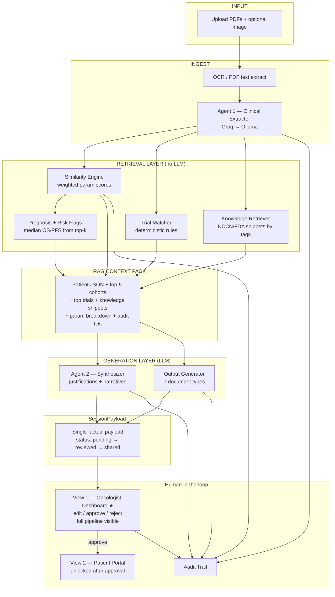

# Oncopilot AI — Final System Blueprint

Complete workflow: simulated data, RAG pipeline, 2-agent architecture, similarity engine, Phase 1/2 outputs, **oncologist-first dashboard (View 1)**, optional patient portal (View 2), and **4-person team split** (3 backend + 1 frontend).

### The Two Views

| | **View 1: Oncologist Enterprise Dashboard** ★ | **View 2: Patient Localization Portal** (stretch) |
|---|-----------------------------------------------|-----------------------------------------------------|
| **Priority** | **Primary — full pipeline surfaced here** | Secondary — plain-language cards only |
| **Route** | `/dashboard/[sessionId]` | `/patient/[sessionId]` |
| **Audience** | Oncologist / CRC | Patient + family |
| **Design** | Maximum data density, speed, clinical precision | Calm cards, no jargon, instant localized translations |
| **Data source** | Full `SessionPayload` — extraction, retrieval, both agents, all docs | **Approved subset only** — never re-extracts |
| **Presentation** | Raw clinical labels, scores, cohort IDs, NCT IDs, param breakdown | Hides TCGA-LUAD, Exon 19, SYN-*, scores; en/hi/ta/kn |
| **Gate** | Edit, approve, reject documents | Locked until oncologist approves in View 1 |

---

## 0. Core Principles (Non-Negotiable)

| Rule | Implementation |
|------|----------------|
| No autonomous clinical decisions | Every output labeled **"DRAFT — for oncologist review"** |
| No hallucinated patients/trials/drugs | LLM only sees **retrieved context** in prompt |
| Matching = Python | LLM **explains** matches; does not **pick** them |
| Patient-facing content (View 2) | Locked until oncologist approves in **View 1** |
| One factual payload | Both views read `SessionPayload` — View 2 never re-extracts |
| Audit | Log every step: model, input hash, retrieved IDs, timestamp |

---

## 1. Data Strategy (Final Decision: Simulate)

### What You Seed Once (Before Demo)

```
SQLite: oncopilot.db
├── sessions              ← live uploads
├── historical_cohorts    ← 15–20 SYN-HIST-* rows (fully simulated, coherent packages)
├── trials_cache          ← ~20 NSCLC trials from ClinicalTrials.gov
├── knowledge_snippets    ← mock RAG corpus (NCCN-style + FDA label excerpts)
└── audit_log
```

### Each Simulated Cohort Row = One Coherent Package

```json
{
  "cohort_id": "SYN-001",
  "cancer_subtype": "LUAD",
  "primary_mutation": "EGFR Exon 19 deletion",
  "stage": "IIIB",
  "pd_l1_percent": 10,
  "age": 52,
  "sex": "F",
  "smoking": "never",
  "ecog": 1,
  "pathology_summary": "...",
  "treatment_given": "Osimertinib 80mg PO daily",
  "outcome_os_months": 18,
  "outcome_pfs_months": 14,
  "clinical_outcome": "Stable disease",
  "toxicity_profile": "Grade 2 rash",
  "image_path": null,
  "image_embedding": null
}
```

**Rules:**
- No real patient in repo
- Optional: one real de-identified case used **offline only** to make mock values realistic
- Imaging: text-derived params (lobe, N stage, size mm) from pathology/radiology fields; pixel compare = v2
- Demo patient: `DEMO_PATIENT` JSON/PDF crafted to match `SYN-001` or `SYN-002`
- Never attach random images to real text — each case is one coherent package

### Mock RAG Knowledge Corpus (Not Live NCCN/FDA for Hackathon)

Pre-seed 10–15 short snippets:

```
NCCN-NSCLC-EGFR-001: "EGFR exon 19 del → osimertinib preferred first-line..."
FDA-OSIMERTINIB-001: "Recommended dose 80mg orally once daily..."
```

Tagged by biomarker/drug so Python can retrieve by profile fields.

### Using One Real Patient as Template

| Do | Don't |
|----|-------|
| Export one fully de-identified row | Paste full EHR into Groq/ChatGPT |
| Use it to learn realistic field values | Ask LLM to "generate 20 similar patients" |
| Manually shape SYN-HIST rows from it | Keep real names, dates, hospital IDs |

Seed data is **static and hand-curated**, not LLM-generated.

---

## 2. System Architecture

The oncologist dashboard is the **single surface** for the full analysis pipeline. View 2 is a presentation layer on approved facts only.



### Layer responsibilities

| Layer | Technology | Owner (backend) |
|-------|------------|-----------------|
| **INPUT** | File upload, session creation | BE Dev 1 |
| **INGEST** | OCR (no LLM) + Agent 1 extract | BE Dev 1 (OCR) + BE Dev 2 (Agent 1) |
| **RETRIEVE** | Similarity, trials, knowledge, prognosis — **Python only** | BE Dev 2 |
| **RAG CONTEXT PACK** | Assembled in `pipeline.py` before any generation | BE Dev 1 orchestrates, BE Dev 2 fills |
| **GENERATE** | Agent 2 + Output Generator — **LLM, retrieved context only** | BE Dev 3 |
| **HITL** | Dashboard (primary), Patient portal (stretch), Audit | FE Dev (UI) + BE Dev 1 (approve API) |

**Key rule:** Matching and ranking = Python. LLM explains and drafts — it does not pick cohorts or trials.

---

## 3. End-to-End Pipeline

### STEP 0 — Upload & Session

```
POST /api/upload
→ session_id
→ store raw files in uploads/{session_id}/
```

### STEP 1 — Ingestion (No LLM)

```
OCR (Tesseract + pypdf)
→ raw_text (concat all reports)
→ store page snippets for provenance
```

**Note:** OCR is for scanned **documents**. Tumour/body images use a vision model (v2). For hackathon, extract imaging params from report text.

### STEP 2 — Agent 1 — Clinical Extractor (LLM)

**Input:** raw OCR text  
**Output:** `PatientProfile` JSON

```python
PatientProfile:
  pathology: { subtype, grade, mitotic_index, margins, size_mm, ... }
  genomic:   { egfr, kras, alk, ros1, tp53, stk11, keap1, tmb, pd_l1, ... }
  imaging:   { lobe, n_stage, metastasis_sites, pleural_invasion, ... }
  clinical:  { age, sex, smoking, ecog, stage, prior_therapies, comorbidities, labs }
  missing_fields: [...]
  source_snippets: { field → exact sentence from OCR }
```

Groq first → Ollama fallback. Agent 1 has **zero DB access**.

### STEP 3 — Retrieval Layer (Deterministic — This IS Retrieval for RAG)

**Runs in parallel** after Agent 1 — all retrievers read `PatientProfile` independently, then merge into `RAGContext`. Prognosis and risk flags derive from similarity results (top-k cohorts).

Three parallel retrievers:

#### 3a. Similarity Engine → Top-5 / Top-10 Cohorts

**Hackathon algorithm** (weighted JSON field scoring — skip BioBERT/FAISS for demo):

**Parameters compared (each scored 0–1 separately):**

| Group | Parameters |
|-------|------------|
| Pathology | Cancer subtype, tumour grade, mitotic index, surgical margin, tumour size (mm) |
| Genomic | EGFR, KRAS, ALK, ROS1, TP53, STK11, KEAP1, TMB, PD-L1 %, CNVs |
| Imaging (text) | Tumour location (lobe), N stage, pleural invasion, metastasis sites |
| Clinical | Age, sex, smoking, ECOG, stage (I–IV/TNM), prior treatment lines, comorbidities |

```python
for each SYN-HIST row:
  for each parameter:
    score = categorical_match | numeric_distance | partial
  overall = weighted_average(scores)
  param_breakdown = { param: score, color: green|amber|red }
return sorted cohorts[:10]
```

**Weights example:** genomic 0.35, pathology 0.25, clinical 0.25, imaging-text 0.15

**UI colors:** ≥0.85 green (match), 0.50–0.84 amber (partial), <0.50 red (diverges)

**Post-hackathon:** BioBERT for free-text fields; ResNet/CLIP for paired images; FAISS at scale.

#### 3b. Trial Matcher → Eligible Trials

Deterministic keyword/rules on `trials_cache`:
- Inclusion biomarker match
- Exclusion flags (prior TKI, eGFR < 30)
- Return trials with matched_on / conflicts / raw_eligibility

#### 3c. Knowledge Retriever → Guideline + FDA Snippets

```python
tags = profile.positive_biomarkers + profile.candidate_drugs
snippets = SELECT * FROM knowledge_snippets WHERE tags overlap
limit 5
```

#### 3d. Risk Flags (Python)

- Biomarker discordance
- Renal exclusion (eGFR < 30)
- Prior therapy conflict

#### 3e. Prognosis Stats (Python — Not LLM)

```python
top_k = cohorts[:8]
median_os = median(c.outcome_os_months for c in top_k)
# "Median OS 14.2 mo (range 9–22) in 8 similar institutional cases"
```

### STEP 4 — Assemble RAG Context Pack + SessionPayload

```python
RAGContext = {
  "session_id": "...",
  "patient_profile": profile,
  "top_cohorts": [...],           # with scores + breakdown
  "top_trials": [...],             # with eligibility excerpts
  "knowledge_snippets": [...],     # NCCN/FDA mock
  "risk_flags": [...],
  "prognosis_stats": {...},        # computed numbers
  "source_snippets": profile.source_snippets,
  "retrieval_ids": ["SYN-001", "NCT123", "NCCN-EGFR-001"]
}
```

After Step 5 (Agent 2 + Output Generator), backend assembles the **SessionPayload** — the single object both views consume:

```python
SessionPayload = {
  "session_id": "...",
  "status": "pending",            # pending → reviewed → shared
  "patient_profile": profile,
  "similar_cohorts": top_cohorts,
  "trial_matches": top_trials,
  "risk_flags": risk_flags,
  "prognosis_stats": prognosis_stats,
  "agent2_insights": agent2_output,
  "documents": {
    "treatment_plan": "...",
    "mdt_brief": "...",
    "trial_report": "...",
    "referral_letter": "...",
    "toxicity_check": "...",
    "prognosis": "...",
    "patient_summary_clinical": "..."   # draft — View 1 only until approved
  },
  "retrieval_ids": [...],
  "approved_at": null,
  "approved_documents": null          # populated on View 1 approval
}
```

| Consumer | API | What it gets |
|----------|-----|--------------|
| **View 1** | `GET /api/dashboard/{sessionId}` | Full `SessionPayload` |
| **View 2** | `GET /api/patient/{sessionId}` | `approved_documents` + localized synthesis (403 if not shared) |
| **View 1 approve** | `POST /api/dashboard/{sessionId}/approve` | Sets `status: shared`, snapshots approved docs |

**LLM rule:** *"Use ONLY the context below. Do not invent patients, trials, doses, or outcomes. Cite cohort_id / nct_id / snippet_id."*

### STEP 5 — Generation Layer (LLM, RAG-Grounded)

Agent 2 and the Output Generator both read `RAGContext` in parallel, then merge into `SessionPayload`.

#### STEP 5a — Agent 2 — Synthesizer

**Input:** `RAGContext`  
**Output:** structured JSON

```python
Agent2Output:
  trial_justifications: [{ nct_id, rationale, matched_criteria }]
  cohort_comparison: "Patient aligns with SYN-001 (87% match)..."
  toxicity_warnings: ["SYN-003 had grade 3 colitis on IO..."]
  clinical_question_suggestion: "Candidate for secondary resection?"
```

Temperature 0.1–0.2. Groq → Ollama fallback.

#### STEP 5b — Phase 2 Output Generator (LLM)

Each document = same `RAGContext` + type-specific prompt + Pydantic schema:

| Output | RAG Sources Used | LLM? | View 1 (Dashboard) | View 2 (Portal) |
|--------|------------------|------|--------------------|-----------------|
| **Treatment plan draft** | top-3 cohorts + knowledge_snippets + profile | ✅ | Edit inline → sign | Shown simplified **after approval** |
| **Tumor board (MDT) brief** | profile + timeline + Agent2Output | ✅ | Edit before board | Not shown |
| **Patient summary** | approved profile + approved plan | ✅ | Clinical draft tab | **Primary View 2 content** — localized |
| **Referral letter** | profile + approved plan | ✅ | Edit → export PDF | Not shown |
| **Trial eligibility report** | top_trials + matched criteria | ✅ light | Full matrix with NCT IDs | Simplified "discuss with doctor" |
| **Toxicity / interaction check** | profile.labs + FDA snippets | ✅ light | Flag panel | Plain-language side effects **after approval** |
| **Prognosis estimate** | prognosis_stats (Python) | ✅ format only | Stats + range band | Omitted or vague "your doctor will discuss" |
| **Similar cases** | similarity engine | ❌ | Full cards + scores + SYN IDs | **Never shown** |
| **Molecular profile** | Agent 1 | ❌ | Full grid + source snippets | Lock-and-key analogy only |

**View 1 guardrail:** **"Draft regimen for review — not a prescription"**

**View 2 guardrail:** Generated only from `approved_documents` via empathetic synthesis layer — 8th-grade, en/hi/ta/kn, no AI recommendation voice.

### STEP 7 — View 1: Oncologist Enterprise Dashboard ★

**Priority:** Primary deliverable — surfaces the **entire** pipeline (Agent 1 extraction, Phase 1 retrieval, Agent 2 insights, all generated documents).

**Audience:** Oncologist / CRC before tumor board or clinic  
**Design goal:** Maximum data density, speed, clinical precision — critical vectors in seconds

**Route:** `/dashboard/[sessionId]`

#### Data contract

Reads full `SessionPayload` from Step 4. Renders **clinical truth as-is** — no synthesis layer.

#### Dashboard layout (dense, scannable)

```
┌─────────────────────────────────────────────────────────────────┐
│ HEADER: Patient ID · Session · Stage · Key mutation badges      │
│ Risk flags (banner) · Extraction confidence · [Approve & Share] │
├──────────────────────────┬──────────────────────────────────────┤
│ LEFT: Critical vectors   │ RIGHT: Action panels                 │
│ • Molecular profile grid │ • Similar cases (top-5 cards)        │
│ • TNM / ECOG / PD-L1     │   similarity % · treatment · outcome │
│ • Source snippet links   │   green/amber/red param breakdown    │
│ • Missing fields (amber) │ • Trial eligibility matrix           │
│                          │ • Prognosis band (median OS/PFS)     │
├──────────────────────────┴──────────────────────────────────────┤
│ TABS: Profile | Similar Cases | Trials | Documents | Prognosis  │
├─────────────────────────────────────────────────────────────────┤
│ DOCUMENTS (inline edit):                                        │
│ Treatment draft · MDT 1-pager · Trial report · Referral letter  │
│ Every field editable · "View Source" on every AI-generated line │
└─────────────────────────────────────────────────────────────────┘
```

#### What the oncologist sees (clinical precision)

| Panel | Content | Interaction |
|-------|---------|-------------|
| Molecular snapshot | EGFR, ALK, ROS1, PD-L1, TMB — with assay + source snippet | Click → exact OCR sentence |
| Similar cases | Ranked SYN-HIST cards, 87% match, treatment, OS/PFS, toxicity | Filter by pathology/genomic/imaging/clinical |
| Trial matrix | NCT ID, phase, matched criteria ✓, exclusion conflicts ⚠ | "Eligible for review" — never "Recommended" |
| MDT brief | 1-page: timeline, molecular profile, clinical question | Edit before tumor board |
| Treatment draft | Drug, dose, route, schedule, NCCN citation | Edit inline → sign |
| Prognosis | "Median OS 14.2 mo (range 9–22) in 8 similar cases" | Deterministic stats + uncertainty band |
| Approve | Sets `status: shared` | Unlocks View 2 only after explicit click |

**Tone:** Technical labels, abbreviations OK, density over whitespace. Sub-3-second scan to answer: *mutation? stage? similar case outcome? trial fit?*

---

### STEP 8 — View 2: Patient Localization Portal (stretch)

**Priority:** Secondary — build only after View 1 demo is solid.

**Audience:** Patient + family (Tier-2/3 India context — collective decision-making)  
**Design goal:** Same approved facts, empathetic synthesis — supportive, clear, localized. **No medical jargon** (hide TCGA-LUAD, Exon 19, cohort IDs, NCT IDs, similarity scores).

**Route:** `/patient/[sessionId]`  
**Gate:** Locked until oncologist approves in View 1 (`status !== "shared"` → show "Your doctor is reviewing your results")

#### How it differs from View 1

```
SessionPayload (approved subset)
        ↓
Empathetic synthesis layer (translation.py / patient doc generator)
  • 8th-grade readability
  • No jargon without inline explanation
  • Regional language: en | hi | ta | kn
  • Compassionate tone — facts only, no AI recommendations
        ↓
Patient Localization Portal UI
```

**Rule:** View 2 never calls Agent 1 again or re-extracts. It reads the **oncologist-approved** payload and regenerates presentation only.

#### Portal layout (calm, spacious — opposite of dashboard)

```
┌─────────────────────────────────────────────────────────────────┐
│ Language toggle: [English] [हिंदी] [தமிழ்] [ಕನ್ನಡ]              │
├─────────────────────────────────────────────────────────────────┤
│ "Your care team has reviewed your results"                      │
├─────────────────────────────────────────────────────────────────┤
│ SECTION 1: What we found (plain language)                       │
│ "You have a type of lung cancer called adenocarcinoma..."       │
│ Gene changes explained with lock-and-key analogy                │
├─────────────────────────────────────────────────────────────────┤
│ SECTION 2: What this means for you                              │
│ Approved treatment plan in simple terms (from signed draft)     │
│ Side effects to expect · what is NOT a emergency vs call doctor │
├─────────────────────────────────────────────────────────────────┤
│ SECTION 3: Clinical trials (if applicable)                      │
│ "Your doctor identified trials you may discuss together"        │
│ No ranking · no "you should join"                               │
├─────────────────────────────────────────────────────────────────┤
│ SECTION 4: Questions for your next visit                        │
│ 3–5 suggested questions (from approved patient summary doc)   │
├─────────────────────────────────────────────────────────────────┤
│ FOOTER: "This information was prepared by your care team.       │
│          It is not a diagnosis or prescription from an AI."     │
└─────────────────────────────────────────────────────────────────┘
```

#### Localization rules

| Clinical (View 1) | Patient (View 2) |
|-------------------|------------------|
| "Poorly differentiated adenocarcinoma, pT2aN2M0, Stage IIIA" | "An aggressive lung cancer that has spread to nearby lymph nodes" |
| "EGFR exon 19 deletion (NGS, source: Foundation report p.3)" | "A specific change in your EGFR gene — like a broken lock — that helps guide treatment options" |
| "Osimertinib 80mg PO QD" | "A targeted daily tablet that focuses on your specific gene change" |
| "Eligible for NCT04267848 — review" | "Your doctor found a research study you can ask about at your next visit" |
| "Grade 2 acneiform rash" | "A manageable skin rash that similar patients have experienced" |

#### What View 2 must never show

- Raw similarity scores or cohort IDs
- Unapproved treatment drafts
- "AI recommends" language
- Trial match rankings as prescriptions
- Content generated before oncologist approval

#### API

```
GET  /api/dashboard/{sessionId}         → full SessionPayload (View 1)
POST /api/dashboard/{sessionId}/approve → sets status: shared, snapshots approved_documents
GET  /api/patient/{sessionId}           → 403 if status !== shared; else localized view
POST /api/patient/{sessionId}/summary?lang=hi → empathetic synthesis from approved_documents only
```

### STEP 9 — Audit Log

```
ocr | extract | similarity | trial_match | knowledge_retrieve |
agent2 | doc_treatment | doc_mdt | doc_patient | oncologist_approved
```

Every step: model name, input hash, retrieved IDs, timestamp.

---

## 4. RAG Explained

| Step | What |
|------|------|
| **Retrieval** | Python pulls real rows: SYN-HIST cohorts, NCT trials, NCCN/FDA snippets |
| **Augmentation** | Those rows go into the LLM prompt as context |
| **Generation** | LLM writes drafts **about retrieved facts only** |

Not "LLM remembers patients." **Database → prompt → draft.**

### Vector / Embedding Notes

- **BioBERT + cosine:** for fuzzy medical text similarity (optional post-hackathon)
- **ResNet-50:** 2048-dim image embeddings for tumour/CT images (v2)
- **Storage:** embeddings in SQLite JSON columns — no vector DB needed for 15–20 cases
- **Cosine similarity:** math in Python, not a database type
- **OCR:** converts document images to text — not used for tumour pixel comparison

---

## 5. Inputs & Outputs Reference

### Inputs (What Oncologist Uploads)

| Source | Fields extracted |
|--------|------------------|
| Pathology report | Histological type, grade, mitotic rate, margins, LVI, PNI |
| Radiology report | CT/PET/MRI findings, tumour dimensions, node status, metastasis |
| Genomics / NGS | Driver mutations, TMB, MSI, PD-L1, fusions, CNVs |
| Lab / clinical notes | CBC, CMP, LFTs, ECOG, weight, prior treatments, allergies, comorbidities |
| Patient symptoms | Self-reported (user description field) |

### Outputs by View

| Document | Contents | View 1 | View 2 |
|----------|----------|--------|--------|
| Molecular profile | Biomarkers, stage, source snippets | Full clinical grid | Analogy-based summary only |
| Similar cases | Ranked cohorts, scores, outcomes | Full cards + filters | Hidden |
| Treatment plan | Drug, dose, route, schedule, NCCN citation | Editable draft | Simplified post-approval |
| Tumor board brief | Timeline, molecular snapshot, clinical question | 1-page editable | Hidden |
| Patient summary | Diagnosis, tests, treatment, side effects | Clinical draft tab | **Primary portal content** |
| Referral letter | GP/specialist letter | Export PDF | Hidden |
| Trial eligibility | NCT matches, inclusion/exclusion | Full matrix | "Ask your doctor" framing |
| Toxicity check | Contraindications vs FDA labels | Flag panel | Plain-language side effects |
| Prognosis | Median OS/PFS, uncertainty range | Stats band | Omitted or doctor-mediated |

---

## 6. Hackathon vs Full Vision

| Full plan | Hackathon build |
|-----------|-----------------|
| BioBERT + FAISS | Weighted JSON field scoring |
| ResNet imaging | Text imaging params; UI "pixel v2" badge |
| Live NCCN/FDA APIs | `knowledge_snippets` mock table |
| 200-page history | Concat OCR text; MDT compresses Agent 1 extraction |
| All 7 outputs | **MVP View 1 ★:** profile + similar cases + trials + MDT brief + treatment draft |
| | **Stretch View 1:** referral + toxicity + prognosis + all 7 docs |
| | **Stretch View 2:** localized patient summary + questions for doctor (cut if tight) |

---

## 7. Tech Stack

| Layer | Choice |
|-------|--------|
| Backend | FastAPI + Python 3.11+ |
| Frontend | Next.js (App Router) |
| LLM | Groq (Llama 3.1 70B) → Ollama fallback |
| OCR | Tesseract + pypdf |
| Database | SQLite (aiosqlite) |
| Trials API | ClinicalTrials.gov v2 (seeded cache) |
| Embeddings | Skip for hackathon; SQLite JSON if added later |
| Deploy | docker compose up |

### Environment Variables

```bash
GROQ_API_KEY=...
GROQ_MODEL=llama-3.1-70b-versatile
OLLAMA_BASE_URL=http://localhost:11434
OLLAMA_MODEL=llama3
DATABASE_URL=./oncopilot.db
CLINICALTRIALS_API_BASE=https://clinicaltrials.gov/api/v2
NEXT_PUBLIC_API_URL=http://localhost:8000
DEMO_PATIENT=true   # optional bypass for demo
```

---

## 8. Repository Structure (Create This First)

Scaffold the entire repo in **Step 0** before writing logic. Empty files with docstrings are fine.

```
oncopilot-ai/
├── .env.example
├── .gitignore
├── docker-compose.yml
├── README.md
├── s.md                              # this blueprint
│
├── backend/
│   ├── Dockerfile
│   ├── requirements.txt
│   ├── main.py                       # FastAPI app, CORS, router mounts
│   ├── config.py                     # env settings (pydantic-settings)
│   │
│   ├── agents/
│   │   ├── __init__.py
│   │   ├── extractor.py              # Agent 1 — BE Dev 2
│   │   └── synthesizer.py            # Agent 2 — BE Dev 3
│   │
│   ├── services/
│   │   ├── __init__.py
│   │   ├── ocr.py                    # BE Dev 1
│   │   ├── similarity.py             # BE Dev 2
│   │   ├── trial_matcher.py          # BE Dev 2
│   │   ├── knowledge_retriever.py    # BE Dev 2
│   │   ├── prognosis.py              # BE Dev 2
│   │   ├── document_generator.py     # BE Dev 3
│   │   ├── translation.py            # BE Dev 3 (View 2 synthesis)
│   │   ├── pipeline.py               # BE Dev 1 (orchestrates analyze flow)
│   │   └── audit.py                  # BE Dev 1
│   │
│   ├── db/
│   │   ├── __init__.py
│   │   ├── database.py               # BE Dev 1
│   │   ├── seed_cohorts.py           # BE Dev 1 (15–20 SYN-HIST rows)
│   │   ├── seed_trials.py            # BE Dev 1
│   │   ├── seed_knowledge.py         # BE Dev 1
│   │   └── mock_data/
│   │       ├── cohorts.json            # shared seed data (all 4 edit Day 0)
│   │       ├── trials.json
│   │       └── knowledge.json
│   │
│   ├── models/
│   │   ├── __init__.py
│   │   └── schemas.py                # DAY 0 — all 4 agree here
│   │
│   └── routers/
│       ├── __init__.py
│       ├── upload.py                 # BE Dev 1
│       ├── analyze.py                # BE Dev 1 (calls pipeline.py)
│       ├── dashboard.py              # BE Dev 1 (View 1 API)
│       ├── patient.py                # BE Dev 3 (View 2 API)
│       ├── documents.py              # BE Dev 3
│       └── audit.py                  # BE Dev 1
│
├── frontend/
│   ├── Dockerfile
│   ├── package.json
│   ├── tsconfig.json
│   ├── tailwind.config.ts
│   ├── next.config.ts
│   │
│   ├── app/
│   │   ├── layout.tsx                # FE Dev
│   │   ├── globals.css
│   │   ├── page.tsx                  # upload landing — FE Dev
│   │   ├── dashboard/
│   │   │   └── [sessionId]/
│   │   │       └── page.tsx          # VIEW 1 ★ — FE Dev
│   │   ├── patient/
│   │   │   └── [sessionId]/
│   │   │       └── page.tsx          # VIEW 2 (stretch) — FE Dev
│   │   └── audit/
│   │       └── [sessionId]/
│   │           └── page.tsx          # FE Dev
│   │
│   ├── components/
│   │   ├── shared/
│   │   │   ├── PipelineProgress.tsx
│   │   │   ├── BiomarkerBadge.tsx
│   │   │   └── SourceSnippetLink.tsx
│   │   ├── view1/                    # Enterprise Dashboard
│   │   │   ├── DashboardHeader.tsx
│   │   │   ├── MolecularProfileGrid.tsx
│   │   │   ├── CaseComparisonTable.tsx
│   │   │   ├── TrialMatchTable.tsx
│   │   │   ├── RiskFlagBanner.tsx
│   │   │   ├── PrognosisBand.tsx
│   │   │   ├── DocumentEditor.tsx
│   │   │   ├── MDTBriefPanel.tsx
│   │   │   └── ApproveShareButton.tsx
│   │   └── view2/                    # Localization Portal
│   │       ├── PortalLockedState.tsx
│   │       ├── LanguageToggle.tsx
│   │       ├── PatientSummaryCard.tsx
│   │       ├── PlainLanguageSection.tsx
│   │       ├── TrialDiscussCard.tsx
│   │       └── QuestionsForDoctor.tsx
│   │
│   └── lib/
│       ├── api.ts                    # fetch wrappers + React Query hooks
│       ├── types.ts                  # mirror schemas.py (Day 0)
│       └── mock.ts                   # mock SessionPayload until API ready
│
├── uploads/                          # runtime — gitignored
└── oncopilot.db                      # runtime — gitignored
```

### Who owns which folders

| Folder / file | Owner |
|---------------|-------|
| `main.py`, `config.py`, `db/*`, `ocr.py`, `pipeline.py`, `upload/analyze/dashboard/audit` routers, `services/audit.py` | **BE Dev 1** — Platform & orchestration |
| `agents/extractor.py`, `similarity.py`, `trial_matcher.py`, `knowledge_retriever.py`, `prognosis.py` | **BE Dev 2** — Agent 1 + Phase 1 retrieval |
| `agents/synthesizer.py`, `document_generator.py`, `translation.py`, `patient/documents` routers | **BE Dev 3** — Agent 2 + Phase 2 + patient API |
| `models/schemas.py` | **All 4 — Day 0** |
| `frontend/` entire tree | **FE Dev** — View 1 primary, View 2 stretch |

---

## 9. Team Split — 4 People (3 Backend + 1 Frontend)

```
                         ┌──────────────┐
                         │   FE Dev     │
                         │  View 1 ★    │
                         │  View 2 ~    │
                         └──────┬───────┘
                                │ SessionPayload API
           ┌────────────────────┼────────────────────┐
           ▼                    ▼                    ▼
    ┌─────────────┐     ┌─────────────┐     ┌─────────────┐
    │  BE Dev 1   │     │  BE Dev 2   │     │  BE Dev 3   │
    │  Platform   │────►│  Phase 1 +  │────►│  Phase 2 +  │
    │  & API      │     │  Agent 1    │     │  Agent 2    │
    └─────────────┘     └─────────────┘     └─────────────┘
```

**Pipeline call order in `pipeline.py` (BE Dev 1 owns):**

```
OCR → Dev2.extract() → Dev2.retrieve() → assemble RAGContext
    → Dev3.synthesize() → Dev3.generate_docs() → SessionPayload → dashboard API
```

---

### STEP 0 — All 4 together (2 hours, blocking)

| # | Task | Owner | Output |
|---|------|-------|--------|
| 0.1 | Create repo scaffold (§8 tree) | All | Empty repo committed |
| 0.2 | Define `schemas.py` + `types.ts` | All | `PatientProfile`, `SessionPayload`, `RAGContext`, `Agent2Output` |
| 0.3 | Write `mock_data/cohorts.json` (15–20 SYN-HIST rows) | BE Dev 1 leads | Simulated seed data |
| 0.4 | Rich `frontend/lib/mock.ts` | FE Dev | Full View 1 buildable Day 1 |
| 0.5 | `docker compose up` skeleton | BE Dev 1 | :8000 + :3000 |
| 0.6 | Agree `pipeline.py` call order + audit events | BE 1 + 2 + 3 | Integration contract |

---

### BE Dev 1 — Platform, Orchestration & View 1 API

**Mission:** Upload → OCR → orchestrate full pipeline → persist `SessionPayload` → dashboard + approve + audit.

#### Phase A — Foundation (Day 1 morning)

| Step | Task | Files |
|------|------|-------|
| A1 | FastAPI app + CORS + lifespan | `main.py`, `config.py` |
| A2 | SQLite init + tables | `db/database.py` |
| A3 | Seed scripts run at startup | `seed_cohorts.py`, `seed_trials.py`, `seed_knowledge.py` |
| A4 | File upload endpoint | `routers/upload.py` |
| A5 | OCR service | `services/ocr.py` |

**Checkpoint:** `POST /api/upload` returns `session_id` + raw OCR text.

#### Phase B — Orchestration (Day 1 afternoon – Day 2)

| Step | Task | Files |
|------|------|-------|
| B1 | Pipeline orchestrator (calls Dev 2 → Dev 3) | `services/pipeline.py` |
| B2 | Analyze endpoint | `routers/analyze.py` |
| B3 | Persist `SessionPayload` to `sessions` table | `db/database.py` |
| B4 | Audit log writer | `services/audit.py`, `routers/audit.py` |
| B5 | `DEMO_PATIENT` bypass flag | `routers/upload.py` |

**Checkpoint:** `POST /api/analyze` returns full `SessionPayload` (Dev 2/3 modules can be stubs initially).

#### Phase C — View 1 API + Deploy (Day 2–3)

| Step | Task | Files |
|------|------|-------|
| C1 | `GET /api/dashboard/{id}` | `routers/dashboard.py` |
| C2 | `POST /api/dashboard/{id}/approve` → `status: shared` | `routers/dashboard.py` |
| C3 | `docker-compose.yml` + `Dockerfile` | root + `backend/` |
| C4 | Integration test with FE Dev | — |

**Endpoints owned:** `/api/upload`, `/api/analyze`, `/api/dashboard/*`, `/api/audit/*`

---

### BE Dev 2 — Agent 1 & Phase 1 Retrieval (`plan.txt` backbone)

**Mission:** Extract `PatientProfile`; deterministic similarity, trials, knowledge, prognosis. **No LLM synthesis.**

#### Phase A — Extraction & Matching (Day 1)

| Step | Task | Files |
|------|------|-------|
| A1 | `PatientProfile` Pydantic schema (Day 0) | `models/schemas.py` |
| A2 | Agent 1 extractor (Groq → Ollama) | `agents/extractor.py` |
| A3 | Similarity engine + param breakdown | `services/similarity.py` |
| A4 | Trial matcher + risk flags | `services/trial_matcher.py` |

**Checkpoint:** Given profile JSON → ranked cohorts + trials (unit test, no API needed).

#### Phase B — Retrieval completion (Day 2)

| Step | Task | Files |
|------|------|-------|
| B1 | Knowledge retriever | `services/knowledge_retriever.py` |
| B2 | Prognosis stats (median OS/PFS) | `services/prognosis.py` |
| B3 | Populate `RAGContext` fields for pipeline | coordinate with BE Dev 1 in `pipeline.py` |

**Checkpoint:** Full Phase 1 retrieval feeds View 1: similar cases, trial matrix, prognosis band, risk banner.

**Feeds View 1:** Similar cases panel, trial matrix, prognosis band, risk flags.

---

### BE Dev 3 — Agent 2, Phase 2 Outputs & Patient API (stretch)

**Mission:** RAG-grounded synthesis + all clinical outputs from `plan.txt`. Patient localization only if View 1 is done.

#### Phase A — Synthesis (Day 1–2)

| Step | Task | Files |
|------|------|-------|
| A1 | Agent 2 synthesizer on `RAGContext` | `agents/synthesizer.py` |
| A2 | Document generator — 7 doc types | `services/document_generator.py` |
| A3 | Document edit save endpoint | `routers/documents.py` |

**7 outputs:** treatment plan, MDT brief, patient summary (clinical draft), referral letter, trial report, toxicity check, prognosis format.

**Checkpoint:** Pipeline returns `SessionPayload` with `agent2_insights` + `documents` populated.

#### Phase B — View 2 API (Day 3, stretch)

| Step | Task | Files |
|------|------|-------|
| B1 | `GET /api/patient/{id}` — 403 if not shared | `routers/patient.py` |
| B2 | Empathetic synthesis + localization | `services/translation.py` |
| B3 | `POST /api/patient/{id}/summary?lang=hi` | `routers/patient.py` |

**Endpoints owned:** `/api/patient/*`, document generation internals.

---

### FE Dev — Oncologist Dashboard (primary) + Patient Portal (stretch)

**Mission:** View 1 shows **everything** from both agents + full retrieval + all documents. View 2 = jargon-free cards if time.

#### Phase A — Shell + Upload (Day 1)

| Step | Task | Files |
|------|------|-------|
| A1 | Next.js scaffold + layout + globals | `app/layout.tsx`, `globals.css` |
| A2 | Upload page + file dropzone | `app/page.tsx` |
| A3 | Pipeline progress component | `components/shared/PipelineProgress.tsx` |
| A4 | API client + types + rich mock | `lib/api.ts`, `lib/types.ts`, `lib/mock.ts` |
| A5 | Upload → poll analyze → redirect to dashboard | `app/page.tsx` |

**Checkpoint:** Upload flow navigates to `/dashboard/[sessionId]` with mock data.

#### Phase B — View 1: Enterprise Dashboard (Day 2) ★

| Step | Task | Files |
|------|------|-------|
| B1 | Dashboard page shell + header | `dashboard/[sessionId]/page.tsx`, `DashboardHeader.tsx` |
| B2 | Molecular profile grid + biomarker badges | `MolecularProfileGrid.tsx`, `BiomarkerBadge.tsx` |
| B3 | Similar cases table (green/amber/red) | `CaseComparisonTable.tsx` |
| B4 | Trial match table | `TrialMatchTable.tsx` |
| B5 | Risk flags + prognosis band | `RiskFlagBanner.tsx`, `PrognosisBand.tsx` |
| B6 | Document editor + MDT panel | `DocumentEditor.tsx`, `MDTBriefPanel.tsx` |
| B7 | Approve & Share button | `ApproveShareButton.tsx` |

**Checkpoint:** Full View 1 renders from `GET /api/dashboard/{id}` — sub-3-second clinical scan.

#### Phase C — Audit + View 2 (Day 3)

| Step | Priority | Task | Files |
|------|----------|------|-------|
| C1 | 🔴 | Audit trail page | `audit/[sessionId]/page.tsx` |
| C2 | 🔴 | Swap mock → live API, demo polish | `lib/api.ts` |
| C3 | 🟡 | Locked state when not approved | `PortalLockedState.tsx` |
| C4 | 🟡 | Patient portal + language toggle | `patient/[sessionId]/page.tsx`, `LanguageToggle.tsx`, `PlainLanguageSection.tsx` |

**View 2 must hide:** TCGA-LUAD, Exon 19, cohort IDs, NCT IDs, similarity scores.

---

### Integration Timeline

| When | Milestone | Who |
|------|-----------|-----|
| **Hour 2** | Schemas + mock data + repo scaffold | All 4 |
| **Day 1 EOD** | Upload + OCR + Agent 1 extract | BE 1 + BE 2 |
| **Day 1 EOD** | View 1 shell on mock `SessionPayload` | FE |
| **Day 2 AM** | Phase 1 in pipeline → `RAGContext` | BE 1 + BE 2 |
| **Day 2 PM** | Agent 2 + docs → `SessionPayload` | BE 1 + BE 3 |
| **Day 2 PM** | View 1 live API (cases, trials, prognosis) | FE + BE 1 |
| **Day 3 AM** | All doc editors + MDT + treatment tabs | FE + BE 3 |
| **Day 3 PM** | Demo dry-run; View 2 if time | All |

---

### MVP if time runs out

**Must ship:** Phase 1 + both agents + View 1 (cases, trials, MDT, treatment draft) + `DEMO_PATIENT`.

**Cut first:** View 2, referral PDF export, docs 4–7 beyond treatment/MDT/trials.

---

### API Contract (FE Dev depends on this — Day 0)

```typescript
// frontend/lib/types.ts — must match backend/models/schemas.py

POST /api/upload          → { session_id: string }
POST /api/analyze         → SessionPayload
GET  /api/dashboard/:id   → SessionPayload
POST /api/dashboard/:id/approve → { status: "shared", approved_documents: {...} }
GET  /api/patient/:id     → PatientLocalizedView | 403
POST /api/patient/:id/summary?lang=hi → PatientLocalizedView
GET  /api/audit/:id       → AuditEntry[]
```

---

### If someone is blocked

| Blocker | Workaround |
|---------|------------|
| FE waiting on API | Use `lib/mock.ts` |
| BE 2 waiting on OCR | Test Agent 1 with hardcoded raw text string |
| BE 1 waiting on matchers | Stub `similarity.py` returning `cohorts.json` top-3 |
| BE 3 waiting on RAGContext | Mock `RAGContext` JSON for Agent 2 |
| Analyze too slow | `DEMO_PATIENT=true` returns pre-built `SessionPayload` |

---

## 10. MVP Demo Script

### View 1 — Oncologist Enterprise Dashboard (~2 min)

1. Upload demo PDF (or `DEMO_PATIENT=true`) → pipeline progress → dashboard
2. **Molecular snapshot:** EGFR exon 19 badge + "View Source" snippet
3. **Similar cases:** SYN-001 at ~87% — green/amber/red param grid
4. **Trials:** 3–5 matches, eligibility criteria highlighted, "Eligible for review"
5. **Risk flag:** toxicity warning from matched cohort
6. **Documents:** edit MDT brief, skim treatment draft
7. Click **Approve & Share** → `status: shared`

### View 2 — Patient Localization Portal (~1 min, stretch)

8. Open `/patient/[sessionId]` — no longer locked
9. Toggle language to **हिंदी** (or Tamil/Kannada)
10. Plain-language diagnosis + lock-and-key gene analogy
11. Simplified treatment explanation (from approved draft)
12. "Questions to ask your doctor" section
13. Footer: prepared by care team, not AI prescription

### Audit (~30s)

14. Show retrieval IDs (`SYN-001`, `NCT…`, `NCCN-…`) + approval timestamp

---

## 11. Demo Reliability Checklist

- [ ] `DEMO_PATIENT` env flag bypasses upload
- [ ] 15–20 SYN-HIST cohorts seeded
- [ ] Trial cache pre-seeded from ClinicalTrials.gov
- [ ] Knowledge snippets seeded (NCCN/FDA mock)
- [ ] Ollama running with `llama3` pulled
- [ ] Groq API key tested
- [ ] `docker compose up` tested from cold start
- [ ] Demo patient PDF as backup if browser fails
- [ ] View 2 locked state shows before approval
- [ ] View 2 language toggle tested (at least en + hi)
- [ ] Approve in View 1 unlocks View 2 in same session

---

## 12. Judge Pitch (30 Seconds)

> Oncopilot runs one backend pipeline and puts the full analysis in front of the oncologist first. Agent 1 extracts, Python retrieves and ranks similar cases and trials, Agent 2 explains with RAG context only, and the output generator drafts seven clinical documents — all visible in one dense dashboard for tumor-board speed. Nothing reaches the patient portal until the oncologist approves. Families then see the same approved facts as plain-language cards in English, Hindi, Tamil, or Kannada — no medical jargon.

---

## 13. One-Page Pipeline Summary

See §2 Mermaid diagram. In one sentence:

**Upload → OCR → Agent 1 → parallel Python retrieval → RAG Context Pack → Agent 2 + Output Generator → SessionPayload → Oncologist Dashboard (edit/approve) → optional Patient Portal → Audit Trail.**

---

## 14. Summary Table

| Layer | Technology |
|-------|------------|
| Data | Simulated 15–20 `SYN-HIST` + seeded trials + mock NCCN/FDA snippets |
| Match | Python similarity + trial rules + prognosis stats |
| Explain & draft | RAG — Groq/Ollama with retrieved context only |
| Payload | `SessionPayload` — single source of truth for both views |
| View 1 ★ | Enterprise Dashboard — full pipeline visible, clinical density, edit, approve |
| View 2 | Localization Portal (stretch) — jargon-free cards, regional languages |
| Team | 3 backend (platform · retrieval · generation) + 1 frontend |
| Storage | SQLite (no vector DB for hackathon) |
| Safety | View 2 locked until View 1 explicit approval |
